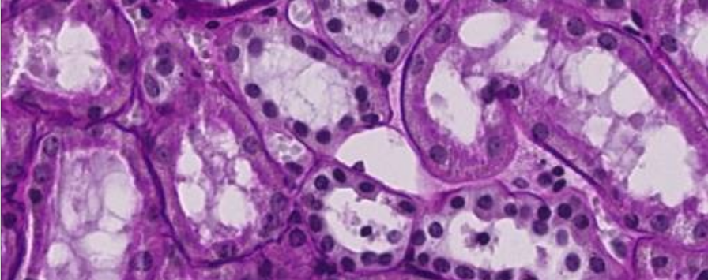

# human-vasculature-segmentation
This project is part of the Kaggle competition [HuBMAP - Hacking the Human Vasculature](https://www.kaggle.com/competitions/hubmap-hacking-the-human-vasculature)

    

## Description

:warning: Code is currently being refactored from jupyter notebook to modular code :warning:

The goal of this competition is to segment instances of microvascular structures, including capillaries, arterioles, and venules.

This work implements and trains a UNet architecture to solve the task.

## Getting Started

For the time being, refer to the [Jupyter noteboook](src/Notebooks/human_vasculature_unet.ipynb) to see a U-Net implementation and training to solve this problem:

## Authors

* Lucia Urcelay Ganzabal
